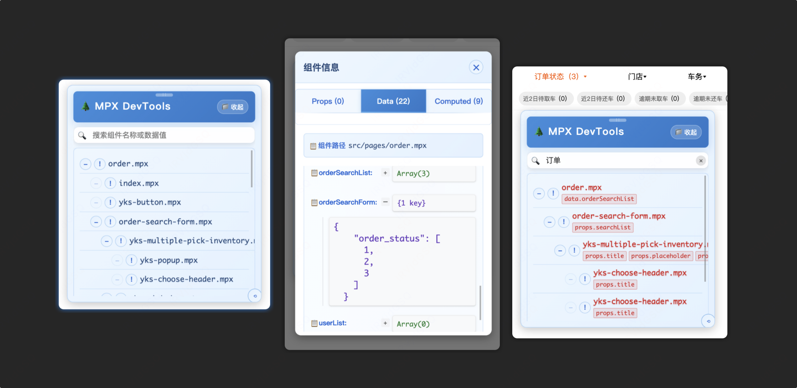

# MPX Devtools

MPX Devtools 是一个为滴滴跨端框架 MPX 开发的开发者工具，它可以帮助开发者可视化查看和修改组件树的数据。


## Why MPX Devtools

在小程序开发过程中，作者经常会遇到以下几个痛点问题：

### 1. 开发体验问题
- 各平台小程序开发者工具限制
  - 热更新不稳定，经常出现更新失败
  - 编译速度慢，影响开发效率
  - 开发工具启动耗时长
  - 调试工具响应迟缓

### 2. 调试困难
- 组件树层级深，难以快速定位问题组件
- 数据流向不直观，难以追踪状态变化
- 缺乏实时的数据监控和修改能力
- 跨端编译后的代码难以追踪源码位置

### 3. 项目维护挑战
- 接手复杂项目时，难以快速理解组件结构
- 组件间的数据流动和依赖关系不清晰
- 缺乏统一的调试工具，跨团队协作效率低
- 项目重构时缺乏可视化辅助工具


MPX Devtools 正是为解决这些问题而生

## 功能特点

- 📊 组件树可视化：实时查看应用的组件树结构
- 🔄 数据监控：实时监控和修改组件的数据状态
- 🛠️ 开发调试：提供便捷的开发调试工具
- 🔌 Webpack 插件支持：通过 Webpack 插件轻松集成，在生产模式 0 侵入

## 安装

使用 npm 安装：

```bash
npm install mpx-devtools --save-dev
```

## 配置

在你的 `mpx.config.js` 中添加以下配置：

```javascript
const MpxDevtoolsWebpackPlugin = require('mpx-devtools/src/webpack-plugin/index.js')

module.exports = defineConfig({
  // ... 其他配置
  configureWebpack(config) {
    const isDev = true // 开发环境下集成
    if(isDev) {
        config.plugins.push(new MpxDevtoolsWebpackPlugin())
    }
  }
})
```

## 项目结构

```
├── src/                    # 源代码目录
│   ├── components/        # 组件目录
│   ├── mixin/            # 混入文件
│   └── webpack-plugin/   # Webpack 插件实现
├── example/               # 示例项目
└── assets/               # 资源文件
```

## 支持平台

- 微信小程序（wx）
- 支付宝小程序（ali）
- 百度小程序（swan）
- 字节跳动小程序（tt）
- 钉钉小程序（dd）

## 使用方法

1. 安装并配置 MPX Devtools
2. 启动你的 MPX 项目
3. 打开对应平台的开发者工具
4. 使用 MPX Devtools 进行调试

## 贡献

欢迎提交 issue 和 Pull Request，一起完善 MPX Devtools。

## 许可证

[ISC License](LICENSE)

## 相关链接

- [MPX 框架](https://github.com/didi/mpx)
- [问题反馈](https://github.com/qirong77/mpx-devtools/issues)
- [项目主页](https://github.com/qirong77/mpx-devtools#readme)

## 作者

qirong77

---

如果这个项目对你有帮助，欢迎给它一个 star ⭐️